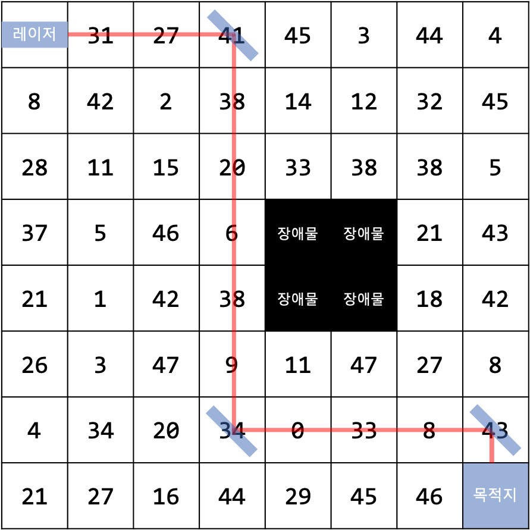
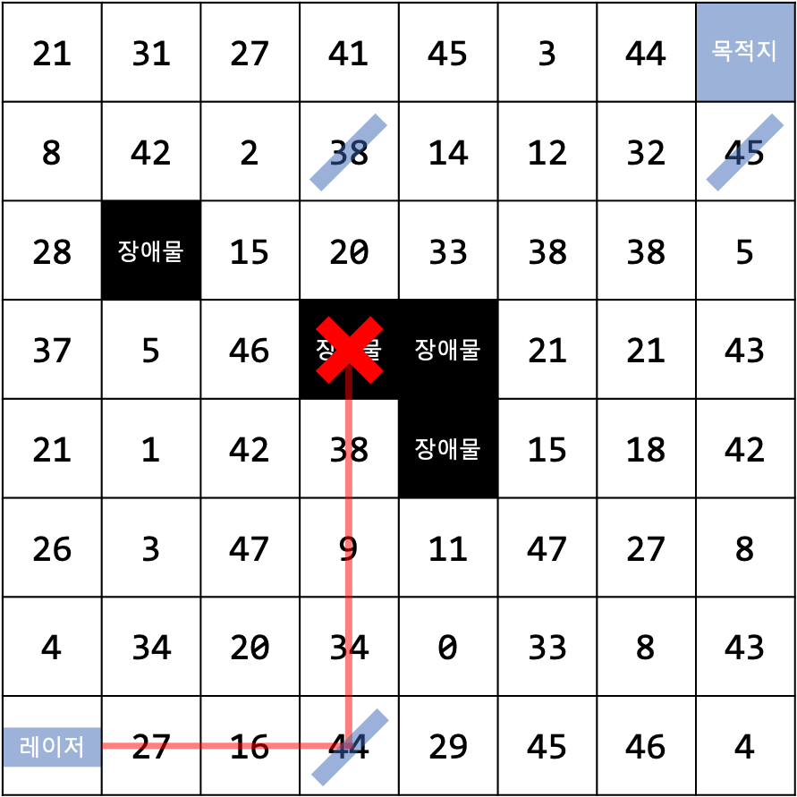

# 레이저 게임

## 문제 설명

시험이 끝나고 소현이는 집에 있는 레이저 포인터와 높이 *H*칸 너비 *W*칸짜리 체스판, 거울 몇 개로 게임을 하려고 한다. 게임의 규칙은 다음과 같다.

1. 체스판의 (0, 0) 위치에 레이저 포인터를 놓고, (*H* - 1, *W* - 1) 위치를 도착점으로 표시한다. 이때 레이저 포인터는 (0, 1)을 가리키는 방향으로 레이저를 발사하도록 방향을 정한다.
2. (0, 0)과 (*H* - 1, *W* - 1) 이외의 위치들에 숫자를 써넣거나, 장애물을 설치한다.
3. 45도 기울어진 `\` 모양 거울을 설치하여 레이저가 도착점에 최단 경로로 도착하도록 한다. 이때 레이저가 지나는 칸들의 수들의 합을 구하여 점수를 계산한다.

거울을 적절히 조합하면 다음과 같이 레이저가 도착점에 도달할 수 있다. 사용할 수 있는 거울의 개수 제한은 없다.

| 목적지에 도달할 수 있는 경우 | 목적지에 도달하지 못하는 경우 |
| ---------------------------- | ----------------------------- |
|     |      |

왼쪽 그림의 경우, 거울은 (0, 3), (6, 3), (6, 7) 위치에 배치되었다. 이때 받을 수 있는 점수는 31 + 27 + 41 + ... + 8 + 43점이다. 또한 오른쪽 그림과 같이 장애물에 레이저가 가려져 있으면 레이저가 목적지에 도달할 수 없기 때문에 게임을 진행할 수 없다. 소현이는 귀찮아서 플레이를 포기한 상태이다. 여러분이 소현이 대신 게임을 플레이하여 점수를 최대화하기 위한 거울 배치를 계산하자.

## 입력 형식

첫 줄에는 체스판의 높이 *H*와 너비 *W*가 주어진다. (2 ≤ *H*, *W* ≤ 1000)

2번째 줄부터 *H* + 1번째 줄까지, 체스판의 각 줄에 쓰여진 숫자 *W*개가 공백으로 구분되어 주어진다. 숫자는 -100 이상 100 이하의 정수이다. 장애물이 있는 칸은 -999로 표시된다. 레이저 포인터가 있는 곳과 목적지가 있는 곳은 0이 입력된다.

이 문제에서 좌표 (*Y*, *X*)는 입력된 데이터의 *Y* + 1행 *X* + 1열을 의미한다. 예를 들어, 다음과 같은 입력이 있다고 할 때,

```
3 3
0 1 2
3 4 5
6 7 0
```

5는 (1, 2) 위치에 있는 것이다.

### 서브태스크 

1. (20점) 장애물이 체스판에 존재하지 않고, 1 ≤ *H*, *W* ≤ 100이다.
2. (30점) 장애물이 체스판에 존재하고, 1 ≤ *H*, *W* ≤ 100이다.
3. (50점) 이외의 다른 조건은 없다.

## 출력 형식

목적지까지 레이저가 도달할 수 있도록 거울 배치를 할 수 없다면 `SOHYUN GAVE UP`을 출력한다.

목적지까지 레이저가 도달할 수 있는 거울 배치가 존재한다면, 첫 줄에는 소현이가 얻을 수 있는 점수를 출력한다.

두 번째 줄부터는 거울의 위치를 `Y X` 형태로 출력한다. 여기서 Y, X는 각각 놓을 거울의 Y, X좌표이다. 어떤 거울을 먼저 출력하는지는 상관 없다. 또한, 최적 경로가 한 개 이상 존재할 수 있는데, 이 경우 어떤 배치를 출력하는지는 정답 여부에 영항을 끼치지 않는다.

## 예제 입력

```
5 5
0 0 0 0 0
10 0 0 0 0
10 0 0 1 0
10 10 0 0 0
0 10 10 10 0
```

## 예제 출력

```
40
0 1
4 1
```
