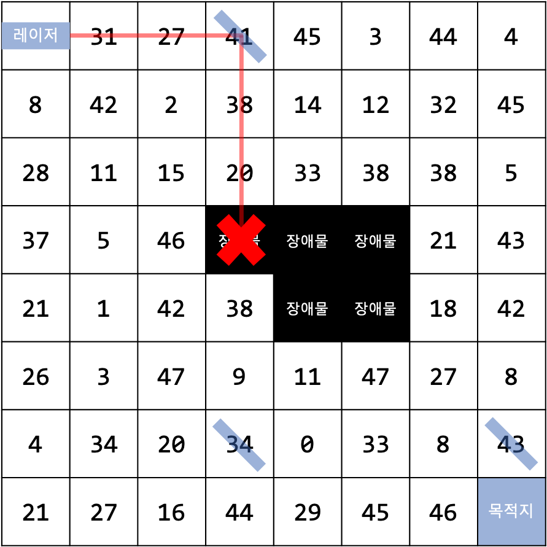

# 레이저 게임

## 문제 설명

시험이 끝나고 소현이는 집에 있는 레이저 포인터와 가로 *W*칸 세로 *H*칸짜리 체스판, 거울 몇 개로 게임을 하려고 한다. 게임의 규칙은 다음과 같다.

1. 체스판의 (0, 0) 위치에 레이저 포인터를 놓고, (*W* - 1, *H* - 1) 위치를 도착점으로 표시한다. 이때 레이저 포인터는 (1, 0)을 가리키는 방향으로 레이저를 발사하도록 방향을 정한다.
2. (0, 0)과 (*W* - 1, *H* - 1) 이외의 위치들에 숫자를 써넣거나, 장애물을 설치한다.
3. 거울을 설치하여 레이저가 도착점에 최단 경로로 도착하도록 한다. 이때 레이저가 지나는 칸들의 수들의 합을 구하여 점수를 계산한다.

거울을 적절히 조합하면 다음과 같이 레이저가 도착점에 도달할 수 있다. 사용할 수 있는 거울의 개수 제한은 없다.

(TODO: 그림 스크린 좌표계로 다시 그리기)

| 목적지에 도달할 수 있는 경우 | 목적지에 도달하지 못하는 경우 |
| ---------------------------- | ----------------------------- |
|     |      |

왼쪽 그림의 경우, 받을 수 있는 점수는 27+16+44+34+…+12+32=335점이다. 또한 오른쪽 그림과 같이 장애물에 레이저가 가려져 있으면 레이저가 목적지에 도달할 수 없기 때문에 0점을 받는다. 소현이는 귀찮아서 플레이를 포기한 상태이다. 여러분이 소현이 대신 게임을 플레이하여 점수를 최대화하기 위한 거울 배치를 계산하자.

## 입력 형식

첫 줄에는 체스판의 높이 *H*와 너비 *W*가 주어진다. (1 ≤ *H*, *W* ≤ 1000)

2번째 줄부터 *H* + 1번째 줄까지, 체스판의 각 줄에 쓰여진 숫자 *W*개가 공백으로 구분되어 주어진다. 숫자는 -100 이상 100 이하의 정수이다.

### 서브태스크 

1. (20점) 장애물이 체스판에 존재하지 않고, 1 ≤ *H*, *W* ≤ 100이다.
2. (30점) 장애물이 체스판에 존재하고, 1 ≤ *H*, *W* ≤ 100이다.
3. (50점) 이외의 다른 조건은 없다.

## 출력 형식

각각의 줄에, 거울의 위치를 “X Y” 형태로 출력한다. (따옴표 제외) 여기서 X, Y는 각각 놓을 거울의 X, Y좌표이다. 어떤 거울을 먼저 출력하는지는 상관 없다.

맨 마지막 줄에는 소현이가 얻을 수 있는 점수를 출력한다.

